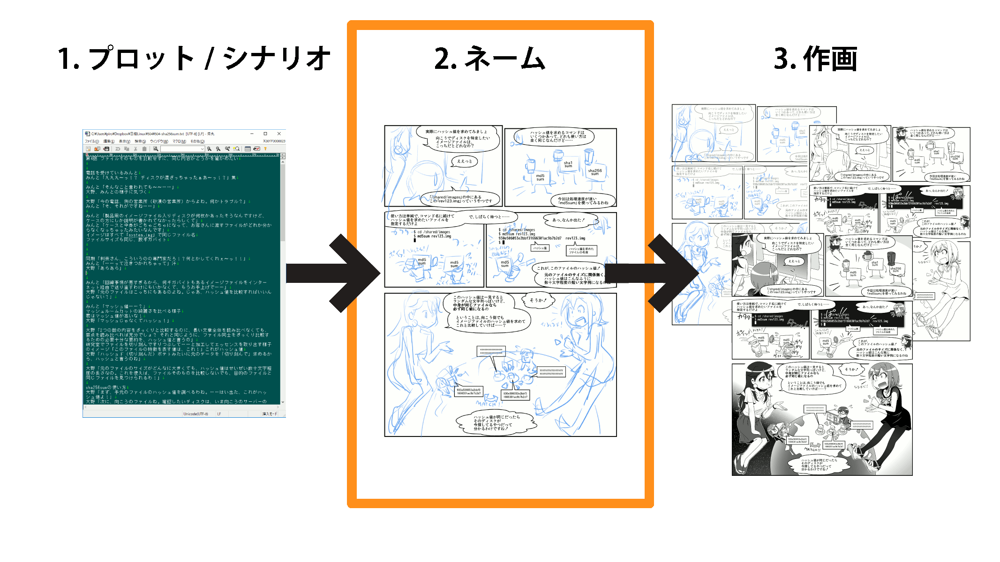
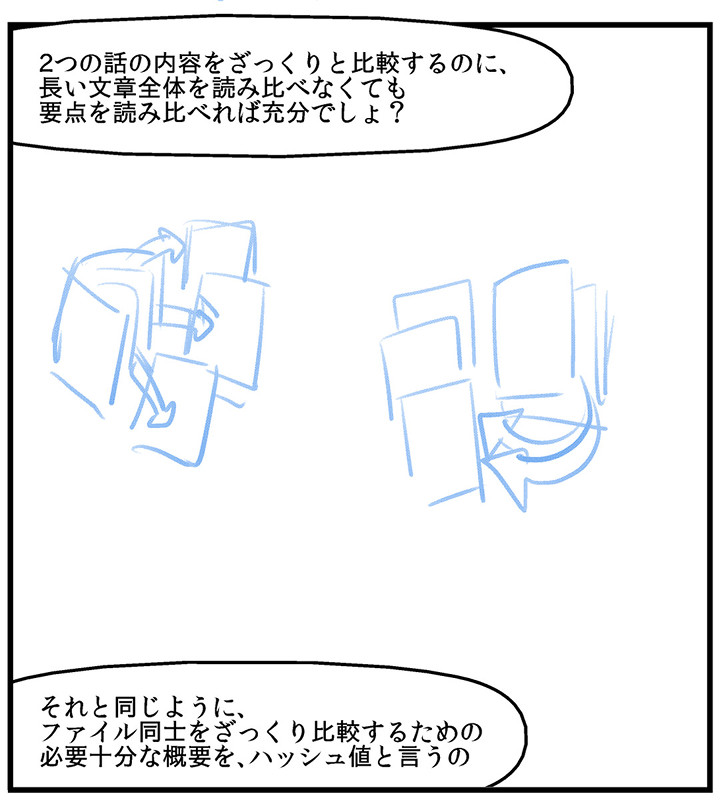
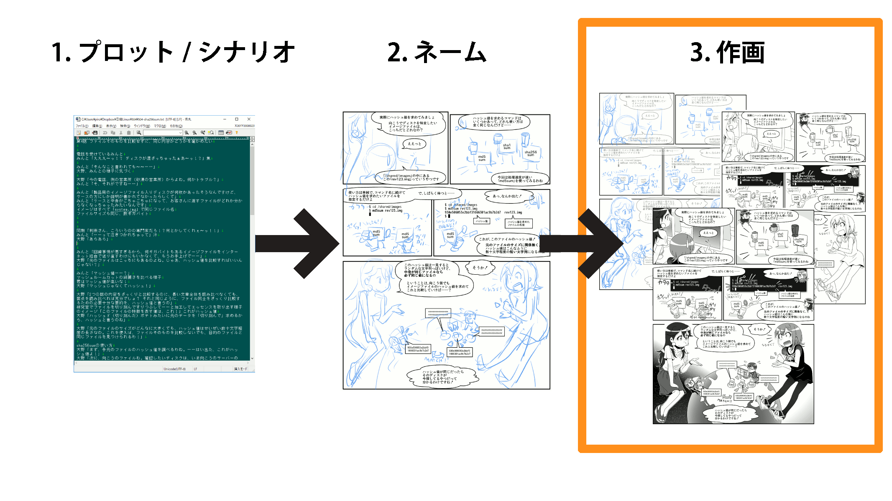

# Linuxコマンド解説まんがのつくりかた

subtitle
:   第114回 PHP勉強会@東京

author
:   Piro / 結城洋志

institution
:   株式会社クリアコード

allotted_time
:   20m

theme
:   .

# 2011年6月6日

一通のメール

> 漫画でLinux（あるいは
> Linuxに関連する技術）を
> 紹介する連載を執筆して
> いただけないでしょうか？

# 　

まじか……

# こうなった

{:relative_height='70'}

月刊日経Linux誌にて連載中（6年目）

# あえてのLinuxコマンド解説

 * デプロイとか構成管理とか
   ツールで自動化が
   当たり前じゃあ……
 * 自分でコマンド打つのが
   許されるのは小学生まで……

そんな時代に抗う！

# Linuxコマンド＆シェルスクリプト解説漫画

{:relative_width='40' align="right" relative_margin_right="-5"}

 * 「SSHでのリモート
   操作」を想定
 * 毎回1つか2つの
   コマンドを紹介
 * シェルスクリプトも
   取り扱う

# 想定する対象読者

 * 企業の*情シス担当者*
   （本誌読者層）
 * Webサービスのデプロイや運用で
   サーバーを操作することがある
   *開発者*の人
 * *コマンド操作に苦手意識*がある人

# 重要と思っているポイント3つ

 * *ケーススタディ形式*
 * *キャラを立てる*
 * *絵で解説する*

# 漫画制作の流れ

{:relative_width='100'}

# 漫画制作の流れ

{:relative_width='100'}

# 1. プロット/シナリオ

~~~
第4話 ファイルそのものを比較せずに、同じ内容かどうかを確かめたい

砂漠の営業所で、ラベルの書かれていないディスクが
ごちゃごちゃになってどれがどれか分からなくなった

みんとが電話を受けて困っていると大野先輩が
ハッシュ値を使ったファイルの判別方法を教えてくれる

ハッシュ値とは

ハッシュ値を比較
md5sum, sha1sum, sha256sum, sha512sum

ディスクの入れ換え、eject

探していたディスクが見つかる

オチ
~~~

# 1. プロット/シナリオ

~~~
第4話 ファイルそのものを比較せずに、同じ内容かどうかを確かめたい

電話を受けているみんと
みんと「えええ〜っ！？ ディスクが混ざっちゃったぁあ〜っ！？」焦

みんと「そんなこと言われても〜〜……」
大野、みんとの様子に気づく

大野「今の電話、例の営業所（砂漠の営業所）からよね。何かトラブル？」
みんと「そ、それがですね……」

みんと「製品用のイメージファイル入りディスクが何枚かあったそうなん
ですけど、ケースの方にしか説明が書かれてなかったらしくて」
みんと「ケースと中身がごちゃごちゃになって、お客さんに渡すファイル
がどれか分からなくなっちゃったみたいなんです」
イメージはすべて「system.img」で同じファイル名
ファイルサイズも同じ、数ギガバイト

...
~~~

# プロット＝話を考える工程

* 何をどう解説するか
* どんな導入で始めて、
  どうオチを付けるか
* *技術的な検証*は
  この段階で済ませる

# Linuxコマンドの世界は底無し！

 * コマンドは数え切れないほどある
 * 網羅的に解説してたらキリが無い
 * どこから解説すればいいの……

# ポイント1

**ケーススタディ形式**

# ケーススタディ形式とは

×「今回紹介するのはこのコマンド！
　　使い方は～……」

◯*「トラブル発生！　困った！」
　「その悩み、このコマンドで
　　解決できるよ」*

# 文脈が大事

 * 人の記憶は*連想型*
 * きっかけから
   *イモヅル式*に思い出す
 * *シチュエーション*とセットで
   覚えてもらうことによる
   *「あっ、これゼミで習った奴だ！」*感

# 印象に残すためのフック

△「これを使うとこうできるでしょ、
    でもってこうしてこうして
    こうすれば……ほらできた！」

◯*「ってことは、これをこうして……
　　あ、あれっ！？ うまくいかない！」
　「ほら、ここを見落としてるよ？」*

*あえて失敗*することで記憶に残る

# ケーススタディ形式のメリット

 * 「この問題を解決する方法」
   という主軸から外れるような
   *関係無い話を容赦なく削れる*
   * 「ちなみに」は禁句！

# 2017年7月号の話の場合

 * セキュリティ関係の話題
 * SHAttered関連ということで
   「ハッシュ値」を解説したい
 * md5sum, sha1sum, sha256sum, sha512sum, ...

# シチュエーション案1

「改竄の検出」にフォーカスしてみる

 * 出自の分からない怪しい
   インストールイメージが
   すでに手元にある
 * 公式サイトで公開されてる
   ハッシュ値と比較すれば安心！

→そんな場面なさそう

# シチュエーション案2

 * 受領したでかいファイルが
   本物かどうか確かめたい
 * ハッシュ値で検証できる！

→そもそも電子署名か暗号化が
　適切では？

# シチュエーション案3

単純な「ファイルの比較」

 * どれが目的のファイルか
   分からなくなった！
 * 送り直す代わりに
   ハッシュ値で比較すれば
   いいのでは？

→もはやセキュリティ関係なし

# ドロップした話題

~~~
* コマンド名の「sum」の由来
  * チェックサムって何？
  * sumはsummaryではなくsummation（合計）
  * ダイジェストって何？
* 電子署名の仕組み
  * フィンガープリントって何？
* 強衝突耐性と弱衝突耐性の違い
* 改竄の検出という使い方
* 信頼できるデータ・信頼できないデータって何？
~~~

# ポイント2

**キャラを立てる**

# 複数の選択肢からどれを選ぶのか

 * nano? Vim? Emacs?
 * while? find? xargs? 配列?

# 「みんとちゃん」というペルソナ

{:relative_width='40' align="right" relative_margin_right="-5"}

 * 難しい話は嫌い
 * 元々ITへの
   関心は薄い
 * 短絡的、早とちり
 * めんどくさがり
 * 飽きっぽい

# nano? Vim? Emacs?

 * less、topなどと操作が似ている
   （「Q」で終了、など）
 * 検索や置換で覚えた知識
   →sedやgrepなどで使える

→Vimが一番
  *覚えることが少なく済みそう*

# while? find? xargs? 配列?

 * findの-execオプションやxargs
   →エッジケースで例外的な
     ルールが後からどんどん出てくる

→whileとreadの組み合わせなら
  とりあえず*安心して使えそう*

# 解説の指針を定めるために

 * 話題の選定
   * →*ケーススタディ*
 * 選択肢の絞り込み
   * →*「どうだったら
   　　みんとちゃんにとって
   　　一番うれしいか？」*

# 基本の心構え

* 「何を教えるか」より
  *「何を教えないか」*を意識しよう
* 語り過ぎは百害あって一利なし！

# 　

## プロパティ

background-image
:   img/bg.jpg

background-image-relative-width
:   100

# 制作の流れ

{:relative_width='100'}

# 2. ネーム

プロット/シナリオを「漫画」にする

 * コマ割り・台詞割り
 * キャラの配置・演技付け
 * 解説の「絵解き」を考える

# 2. ネーム

{:relative_height='80'}

# 2. ネーム

{:relative_height='90'}

# 一般的な漫画のセオリー

 * 早い段階で*全身*や*背景*を出す
 * 絵面に*メリハリ*を付ける
 * セリフよりも*絵で語る*

参考図書：[快描教室プラス](http://amzn.to/2r7ReVp)
　　　　　[漫々快々プラス](http://amzn.to/2rgomJ3)

# ポイント3

**絵で解説する**

# コマンドを擬人化

{:relative_height='90'}

# コマンドを擬人化

{:relative_height='90'}

# でも実際に絵にしようとすると

 * テキストどおりに絵を描いてみても
   *違和感*を覚える時がある
 * 例え話の絵と実際の解説とが
   *自然に繋がらない、しっくりこない*
 * メタファを絵にしたいのに、できない

# 例：「ハッシュ値」の説明

プロット段階

~~~
大野「2つの話の内容をざっくりと比較するのに、
　　　長い文章全体を読み比べなくても、要点を
　　　読み比べれば充分でしょ？
　　　それと同じように、ファイル同士をざっくり
　　　比較するための必要十分な要約を、
　　　ハッシュ値と言うの」
~~~

ちょっと長めのセリフだけ

# 絵にしてみた1

{:relative_height='80'}

# 絵にしてみた2

{:relative_height='80'}

# 違和感の元

* 言葉で十分な*つもり*だった
* *「ハッシュ値」という「物」*
  が絵になっていない！
* ていうか*1枚の絵にできない*！
  （現実に対応する物が無い）

# 見直しの糸口

* でも、「どういう性質があるか」
  「どうやって作られるか」は
  分かっている気がする

→それこそが*伝えるべき知見*、
　自分の中にある*メンタルモデル*

# ポイント3（再掲）

**絵で解説する**

「絵にしようとしてしにくい」
→*面倒がらずに絵にしよう！*

# 絵にできるところから絵にする

「ハッシュ値」
そのものではなく
まず*「ハッシュ値の
求め方」*を絵に

{:relative_width='40' align="right" relative_margin_right="-5"}

これに続けて……

# 擬人化されたコマンド＋実例

{:relative_width='80'}

実際のハッシュ値を求める工程は
もっと後にする予定だったが、
*順番を入れ替えて*手前へ持ってきた

# こんな感じでネームが難航

 * プロット/シナリオの見直し
 * 話の流れの前後の入れ換え

真っ白なコマを残して後工程に進むと
*大幅な手戻り*が発生する！

# 別の例：「トンネリング」の説明

 * SSHポートフォワード
 * あるコンピュータの
   指定ポートで待ち受けて、
   そこで受け付けた通信を
   別のコンピュータの
   指定ポートに転送する

# ポイント3（再々掲）

**絵で解説する**

# 指定ポートで通信を待ち受ける

{:relative_height='70'}

絵の中のみんとちゃんの立ち位置
　　　　＝読者の視点

# トンネルの出口から転送先へ向かう

{:relative_width='80'}

複雑なものは*1ステップずつ*絵にする

# トンネルの全体像

{:relative_height='50'}

全体を見せるのは「*おさらい*」の時

# 漫画は「時間の経過」を表現できる

 * 複雑なことも、*時系列で順に
   少しずつ*見ていけば理解しやすい
 * 「情報密度の高い1枚絵」は
   すでに知識がある人向けの
   チートシート

# 　

## プロパティ

background-image
:   img/bg.jpg

background-image-relative-width
:   100

# 制作の流れ

{:relative_width='100'}

# あとは絵を完成させるだけ

 * 下描き（衣装の決定）
 * ペン入れ
 * 仕上げ（塗り）

# ポイント2（再掲）

**キャラを立てる**

# みんとちゃんの衣装

毎日鏡の前で
嬉々として
ファッションショー
してそうな
イメージ

{:relative_width='45' align="right" relative_margin_right="-1"}

# 大野先輩の衣装

無難な感じで……

{:relative_width='40' align="right" relative_margin_right="-1"}

◯ggi参考

# 扉絵（？）

{:relative_width='80'}

# 後は編集部に託す

 * 納品
 * 校正

# 　

## プロパティ

background-image
:   img/bg.jpg

background-image-relative-width
:   100

# まとめ：解説として

 * 解説漫画でも普通の記事でも
   プロット/シナリオまでの工程は
   あまり変わらない
 * 漫然と解説するのではなく、
   誰に向けて何のために
   解説するかを意識しよう

# まとめ：解説漫画として

 * 「漫画」のセオリーは
   ちゃんと押さえておこう
 * 漫画という表現形式ならではの
   強みを活かそう
   * ×台詞ばっかり/顔のアップばっかり
   * ◯絵で説明

# ここから分かること

 * 「解説漫画」は*ネームが重要*
 * 専門知識がないと
   解説漫画のネームは作れない！

# 分業するなら

×「専門家がテキストで原作」＋
　「ネーム以降を漫画家が担当」

◯「専門家がテキストで原作」＋
　「ネーム以降を
　 *専門知識のある漫画家*が担当」

◯「*専門家がネームまで原作*」＋
　「下描き以降を漫画家が担当」

# 「シス管系女子」で検索！

{:relative_width='80'}

system-admin-girl.com で
*サンプル代わりの特別編*を公開中！

# Kindle版は時々セールに

{:relative_width='40' align="right" relative_margin_right="-1"}

「コンピュータ・IT」
カテゴリで一瞬だけ
ランクインしてたり

# Twitterアカウント運用中

{:relative_height='80'}
